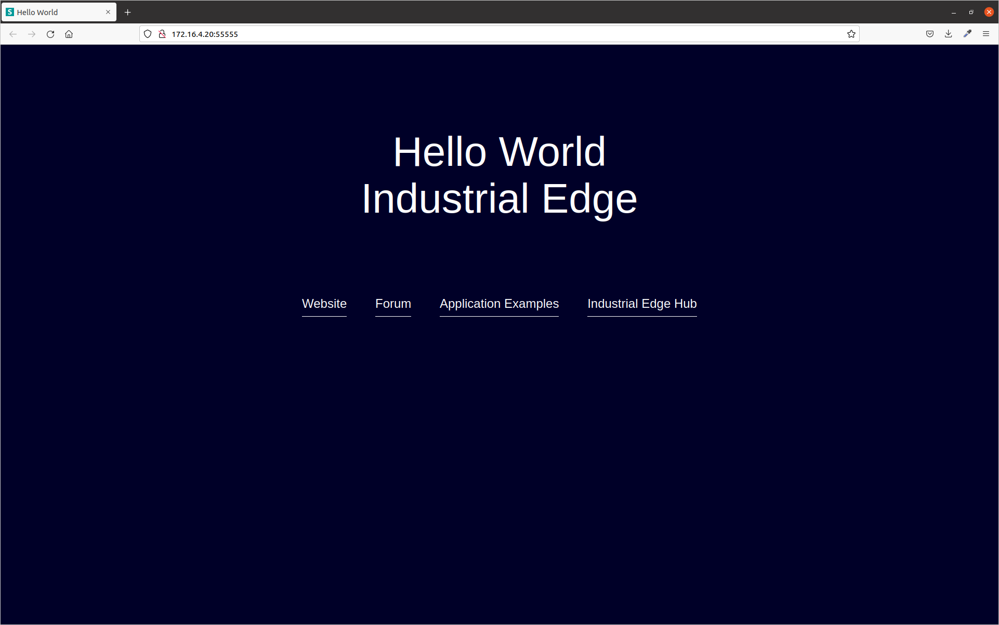
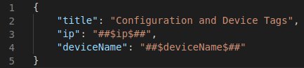
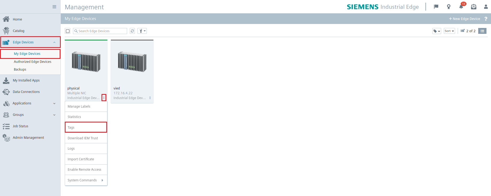
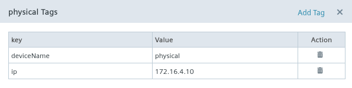
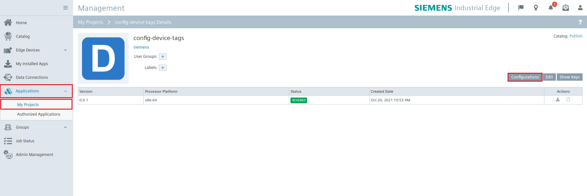
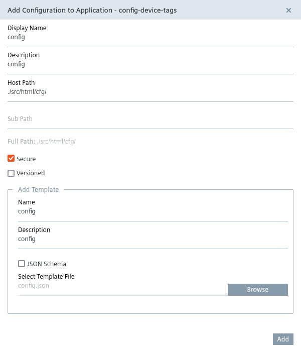
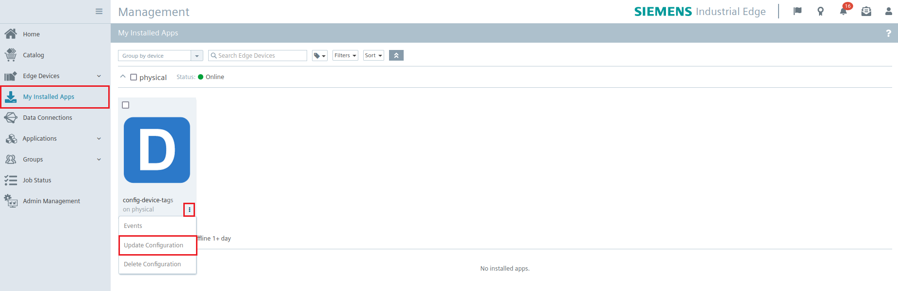
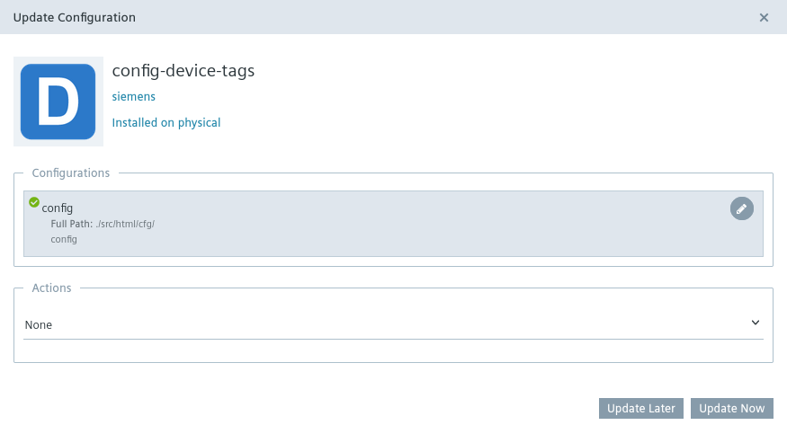
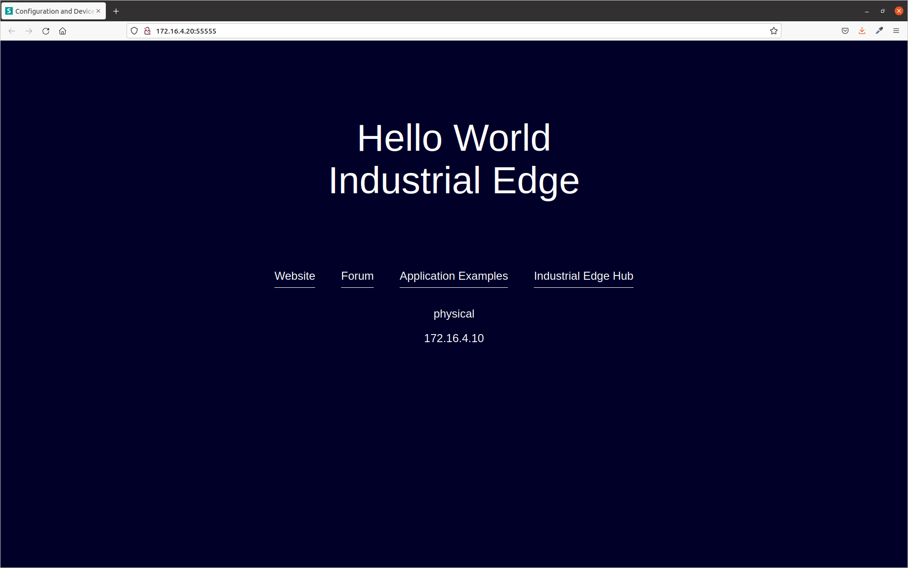

# Using configuration files and device tags to personalize applications

This application example shows how to use configuration files and device tags for mass demployment.

- [Using configuration files and device tags to personalize applications](#using-configuration-files-and-device-tags-to-personalize-applications)
  - [Description](#description)
    - [Overview](#overview)
  - [Requirements](#requirements)
    - [Used Components](#used-components)
  - [Installation](#installation)
  - [Usage](#usage)
  - [Documentation](#documentation)
  - [Contribution](#contribution)
  - [License and Legal Information](#license-and-legal-information)

## Description

### Overview

This application is based on the [Hello World](https://github.com/industrial-edge/hello-world) application example.

## Requirements

### Used Components

- OS: Windows or Linux
- Docker minimum V18.09
- Docker Compose V2.4
- Industrial Edge App Publisher (IEAP) V1.2.7
- Industrial Edge Management (IEM) V1.3.0-58
- Industrial Edge Device (IED) V1.2.0-56

## Installation

This example is based on the Hello World application, you can find how to install it [here](https://github.com/industrial-edge/hello-world/blob/main/docs/installation.md)

## Usage

After installing the application, login to the Industrial Edge Device and click on the application icon to open a web page in your browser.

As we can see, the application looks the same as the original Hello World application.

We will create new JSON file that will contain our configuration with the following content.

The *##$ip$##* and *##$deviceName$##* indicate placeholders that will be replace by device tags.

Let's now create the device tags. Head over to Industrial Edge Management and open *Edge Devices/My Edge Devices/.../Tags*.

Add the two tags as mentioned before.

Now we will upload our config.json file to Industrial Edge Management. Open *Applications/My Projects/config-device-tags/Configurations* and add new configuration.

The template file is the *config.json* file we created earlier.

Now that we have created the configuration, we will download it to the Industrial Edge Device. Open *My Installed Apps/.../Update Configuration*

After the configuration is downloaded, refresh the application website. You should see the device name and IP displayed.

## Documentation

You can find further documentation and help in the following links

- [Industrial Edge Hub](https://iehub.eu1.edge.siemens.cloud/)
- [Industrial Edge Forum](https://support.industry.siemens.com/tf/ww/en/threads/338)
- [Industrial Edge Landing page](https://new.siemens.com/global/en/products/automation/topic-areas/industrial-edge/production-machines.html)
- [Industrial Edge GitHub page](https://github.com/industrial-edge)

## Contribution

Thanks for your interest in contributing. Anybody is free to report bugs, unclear documentation, and other problems regarding this repository in the Issues section or, even better, is free to propose any changes to this repository using Merge Requests.

## License and Legal Information

Please read the [Legal information](LICENSE.md)
